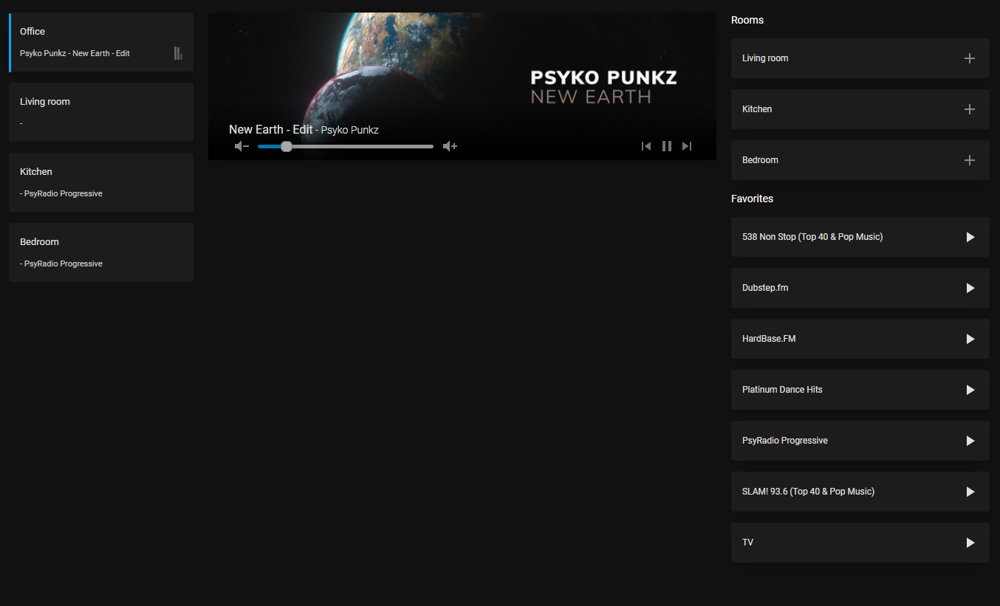

# Sonos Card by [@brantje](https://www.github.com/brantje)

Sonos card

[![GitHub Release][releases-shield]][releases]
[![License][license-shield]](LICENSE.md)

![Project Maintenance][maintenance-shield]
[![GitHub Activity][commits-shield]][commits]

[![Discord][discord-shield]][discord]
[![Community Forum][forum-shield]][forum]

## Options

tbd

[commits-shield]: https://img.shields.io/github/commit-activity/y/brantje/sonos-player-card.svg?style=for-the-badge
[commits]: https://github.com/brantje/sonos-player-card/commits/master
[devcontainer]: https://code.visualstudio.com/docs/remote/containers
[discord]: https://discord.gg/5e9yvq
[discord-shield]: https://img.shields.io/discord/330944238910963714.svg?style=for-the-badge
[forum-shield]: https://img.shields.io/badge/community-forum-brightgreen.svg?style=for-the-badge
[forum]: https://community.home-assistant.io/c/projects/frontend
[license-shield]: https://img.shields.io/github/license/custom-cards/boilerplate-card.svg?style=for-the-badge
[maintenance-shield]: https://img.shields.io/maintenance/yes/2022.svg?style=for-the-badge
[releases-shield]: https://img.shields.io/github/release/brantje/sonos-player-card.svg?style=for-the-badge
[releases]: https://github.com/brantje/sonos-player-card/releases
